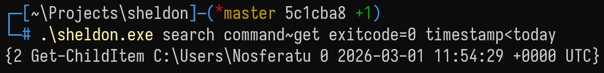

> A minimal shell-agnostic shell history recorder written in Go. 
> Inspired by [atuin](https://github.com/atuinsh/atuin), built for recreational purposes.

Records:

- Command.
- Current Working Directory (CWD).
- Exit Code.
- Timestamp.
- Shell. (Tentative)
- User. (Tentative)
- TimeElapsed. (Tentative)

> [!Important]
> Work in Progress

## Getting Started

```bash
go build
```

## Run

Example:

```bash
./sheldon record "ls -la" "/home/nosferatu" 0
```

PowerShell:

```powershell
.\sheldon.exe search command~get exitcode=0 timestamp<today
```

```console
> .\sheldon.exe search "command~get exitcode=0 timestamp>`"yesterday`""
{2 Get-ChildItem C:\Users\Nosferatu 0 2026-03-01 11:54:29 +0000 UTC}
```



## References

1. Atuin: <https://github.com/atuinsh/atuin.git>
2. SQLite Notebook: <https://sqlite-notebook.9th.fun>